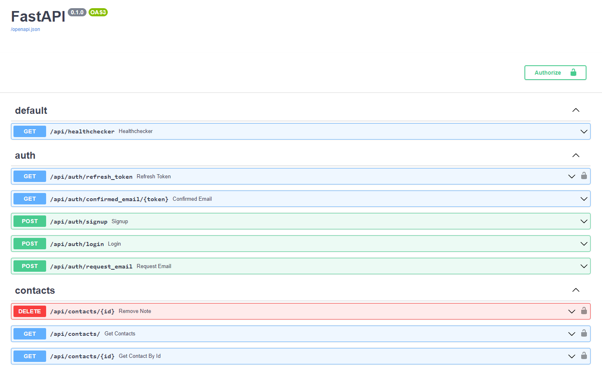

# REST API
FastAPI

<a href="https://rest-api-example.fly.dev/">Visit REST API Example</a>

<h3>So this is an Example of REST API and here you can:</h3>
<ul>
  <li>Sign up and Log in</li>
  <li>Confirm your Email</li>
  <li>Get refresh Token</li>
   <li>Upload avatar</li>
  <li>CRUD Contact</li>
  <li>Get contacts who have a birthday next week</li>

</ul>  

  
  
  

I used the next technologies and packages
<ul>
  <li>Python</li>
  <li>HTML/CSS</li>
  <li>Bootstrap</li>
  <li>Rest API</li>
  <li>Cloudinary</li>
  <li>Postgres</li>
  <li>SQLAlchemy</li>
  <li>Alembic</li>
  <li>Docker</li>
</ul>  

